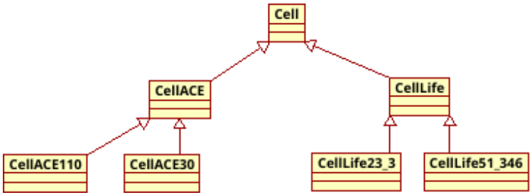
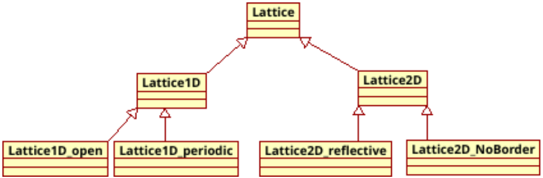
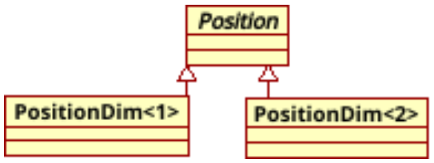
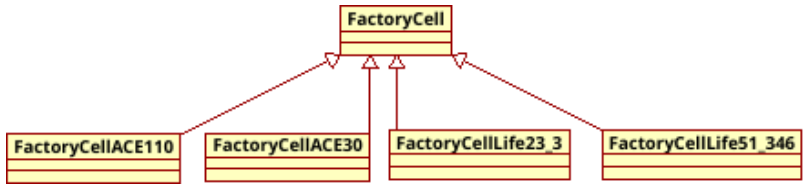

# Práctica 3: Autómata Celular General
Algoritmos y Estructuras de Datos Avanzadas

## 1. Objetivo
En esta práctica se implementan tipos de datos definidos por el usuario utilizando sobrecarga de operadores, herencia, polimorfismo dinámico y manejo de excepciones en lenguaje C++.

## 2. Entrega
Se realizará durante la sesión de entrega en el laboratorio entre el 4 y el 8 de marzo.

## 3. Enunciado
En las prácticas anteriores, [[1](https://campusingenieriaytecnologia2324.ull.es/mod/resource/view.php?id=18524)] y [[2](https://campusingenieriaytecnologia2324.ull.es/mod/resource/view.php?id=18528)] se han implementado dos ejemplos de autómata celular [[3](https://es.m.wikipedia.org/wiki/Aut%C3%B3mata_celular)] y algunas variantes sobre los mismos. Hemos visto que, aunque las implementaciones utilizan estructuras de datos diferentes, en un caso vector unidimensional y en otro caso un tablero bidimensional, ambos comparten la especificación de las operaciones. Además, se han identificado puntos del código sobre los cuales es fácil definir nuevas variaciones en el funcionamiento. En concreto, se han planteado los siguientes puntos de variación:

1. El tratamiento con distintas condiciones de frontera, que afecta al retículo.
2. La implementación de distintas funciones de transición local, incluyendo la definición de la
vecindad, que afecta a la célula.

En esta práctica se aborda el reto de unificar las distintas implementaciones y sus variantes en un único programa que permita al usuario configurar el autómata celular a construir, y ejecutar la evolución en generaciones del mismo. Denominamos autómata celular general a la
implementación del código que permite al usuario elegir la versión del autómata celular entre las ya vistas, y que permite extender la implementación, reutilizando el código, con nuevas versiones de autómatas celulares.

Empezamos revisando la especificación de la célula para convertirla en una jerarquía, donde la
clase base `Cell` es abstracta y contiene las especificaciones y el código común a cualquier tipo de célula. A partir de esta clase base se derivan dos tipos de células:
- `CellACE`, que recoge las especificaciones comunes en la implementación de cualquier autómata celular elemental [4]. Esta clase, que sigue siendo abstracta, se puede particularizar para cada una de las 256 posibles reglas de transición definidas para este tipo de autómata celular.
- `CellLife`, que recoge las especificaciones comunes en la implementación del juego de la vida [5]. Esta clase, que sigue siendo abstracta, se puede particularizar para cada una de las posibles variantes del juego, cambiando la definición de la vecindad y utilizando distintas reglas de transición local.

En el siguiente diagrama de clases se muestra la jerarquía de la familia de células incluyendo los casos particulares que implementan las reglas 110 y 30, para el autómata celular elemental; y los casos particulares de células del juego de la vida para las reglas “23/3” y “51/346”.

<p align="center">
  
</p>

La siguiente tabla contiene la expresión algebraica de la función de transición local para dos casos particulares de células del autómata celular elemental

| Regla | 111 | 110 | 101 | 100 | 011 | 010 | 001 | 000 | $L^{(G)}C^{(G)}R^{(G)}$ |
|-------|-----|-----|-----|-----|-----|-----|-----|-----|-------------------------|
| 110   | 0   | 1   | 1   | 0   | 1   | 1   | 1   | 0   | $C^{G+1}=(C^{(G)}+R^{(G)}+C^{(G)}*R^{(G)}+L^{(G)}*C^{(G)}*C^{(G)}) \% 2$ |
| 30    | 0   | 0   | 0   | 1   | 1   | 1   | 1   | 0   | $C^{G+1}=(L^{(G)}+C^{(G)}+R^{(G)}+C^{(G)}*R^{(G)}) \% 2$ |

También debemos revisar la especificación del retículo para convertirlo en una jerarquía de clases, donde la clase base `Lattice` es abstracta y define las responsabilidades asignadas a este tipo de datos, permitiendo que sean sus clases derivadas las que especifican las diferentes implementaciones. A partir de la clase base se derivan dos tipos de retículo:
- `Lattice1D`, que contiene la definición e implementación común para las distintas variaciones de un retículo unidimensional.
- `Lattice2D`, que contiene la definición e implementación común para las distintas variaciones de un retículo bidimensional.

En el siguiente diagrama de clases se muestra la jerarquía de la familia de retículos, donde se implementan los casos particulares para tratar las condiciones de frontera abierta, periódica, reflectiva y sin frontera, tanto para un espacio celular unidimensional como para un espacio celular bidimensional.

<p align="center">
  
</p>


Por simplicidad vamos a considerar que todas las versiones de autómata celular que pueden configurarse a partir de las jerarquía de retículo y célula utilizan alfabetos cuyos estados se pueden representar mediante un mismo tipo dato `State`.

Finalmente, hay que unificar la definición del tipo de dato `Position` para permitir representar posiciones en retículos de cualquier dimensión. Para ello definimos una nueva jerarquía de clases, donde cada clase derivada implementa el concepto de posición en una determinada dimensión.

Utilizamos una plantilla, `PositionDim<int Dim, class Coordinate_t=int>`, que deriva de la clase base abstracta `Position`.

<p align="center">
  
</p>

## 4. Notas de implementación
Se indican a continuación las modificaciones que hay que realizar en cada uno de los tipos de datos para generalizar la implementación.

  1. En primer lugar vamos a definir la jerarquía de clases `Position` para permitir representar posiciones en retículos de cualquier dimensión.
  
      a. La clase base `Position` es abstracta y contiene la definición de operaciones requeridas por el tipo de dato independientemente de la dimensión.
      
        ```cpp
        typedef int Coor_t;
            class Position {
             public:
              // Operador de acceso a la i-ésima coordenada
              virtual Coor_t operator[](unsigned int) const = 0;
            };
        ```

      b. Las clases derivadas, que representan una posición en la dimensión indicada, se generan a partir de la siguiente plantilla. Se incluye el código del constructor, que utiliza una lista de parámetros variable definida en `<stdarg.h>` [[6](https://cplusplus.com/reference/cstdarg/)].
      ```cpp
      template <int Dim=2, class Coordinate_t=int>
      class PositionDim: public Position {
       private:
          Coor_t Coordinates[Dim];

       public:
          // Constructor con lista variable de parámetros
          PositionDim(int sz, ...) {
            va_list vl;
            va_start(vl, sz);
            for(int d=0; d<Dim; d++) {
              Coordinates[d] = va_arg(vl, Coor_t);
            }
            va_end(vl);
          }

          Coor_t operator[](unsigned int) const;
      };
      ```

      c. El intento de acceder a una coordenada de la posición que está fuera del array Coordinates genera una excepción del tipo `ac_exception`, que deriva de la clase estándar `std::exception` [[7](https://cplusplus.com/reference/exception/)].

  2. En la clase `Cell`, hay que cambiar a protegida la visibilidad de sus atributos para facilitar el acceso desde las clases derivadas. Además, para poder gestionar una posición de cualquier dimensión se cambia el tipo del atributo por una referencia a la clase base `Position`.

      a. El constructor de la clase base mantiene su especificación. Las clases derivadas deben proveer su propio constructor que hará uso explícito del constructor de la clase base.
      ```cpp
      Cell::Cell(const Position&, const State&);
      ```
      b. Se mantienen las operaciones de acceso al estado de la célula.
      ```cpp
      State Cell::getState() const;
      State Cell::setState(State);
      ```

      c. La operación para calcular el siguiente estado de la célula se convierte en un
      método nulo. Cada tipo de célula define su vecindad y su función de transición
      local, por lo que no existe un código común para todos los tipos derivados.
      ```cpp
      virtual void Cell::nextState(const Lattice&) = 0;
      ```
      d. Aunque la actualización del valor del estado tiene una implementación común para
      las clases derivadas, el método que la implementa se convierte en virtual para
      permitir extender este comportamiento si fuese necesario en algún tipo particular.
      ```cpp
      virtual void Cell::updateState();
      ```
      e. Se añade un método nulo con visibilidad protegida para implementar la
      visualización en pantalla. Cada tipo de célula es responsable de su visualización y
      utiliza los caracteres que elija para representar cada uno de sus estados.
      ```cpp	
      virtual ostream& Cell::display(ostream&) = 0;
      ```
      f. El operador de inserción en flujo se sobrecarga como función amiga de la clase
      base. Su implementación consiste en invocar al método virtual que realiza la
      visualización.
      ```cpp
      friend ostream& operator<<(ostream&, const Cell&);
      ```
  
  3. La clase `Lattice` mantiene la responsabilidad de crear y almacenar las células que representan el espacio celular. Como la representación del espacio celular requiere una estructura de datos diferente, según la dimensión del espacio, se delega a las clases derivadas la especificación del atributo.

      a. A partir de la clase base `Lattice` se derivan las clases para cada dimensión.
      Cada clase derivada define la estructura de datos apropiada para contener los
      punteros de tipo `Cell*` que apuntan a las células. La clase `Lattice1D` define una
      estructura de datos unidimensional, y la clase `Lattice2D` define una estructura de
      datos bidimensional.

      b. El constructor del retículo inicializa los punteros de la estructura de datos con la dirección de la célula creada en memoria dinámica.
      
      c. Para indicar al constructor del retículo el tipo de células que debe crear se le pasa un nuevo parámetro de la clase `FactoryCell`, definida por la siguiente jerarquía.

      <p align="center">
        
      </p>

      ```cpp
      class FactoryCell {
       public:
        // Método creador de células
        virtual Cell* createCell(const Position&, const State&) const=0;
      };

      // Replicar para cada tipo de célula
      class FactoryCellAce100: public FactoryCell {
       public:
        Cell* createCell(const Position& p,const State& s) const {
          return new CellAce100(p, s);
        }
      };
      ```

      d. El retículo dispone de un constructor que inicializa todas las células a un estado por defecto, y luego solicitará por teclado la posición de las células que deben tener otro valor de estado en la configuración inicial.
      
      e. El retículo implementa un segundo constructor que recibe como parámetro el nombre de un fichero. La primera fila del fichero de texto contiene la dimensión de espacio celular; en la segunda fila se indica el tamaño inicial del retículo para cada dimensión. A continuación contiene las cadenas de caracteres que representan el estado de las células.
      ```cpp
      Lattice::Lattice(const char*, const FactoryCell&);
      ```
      
      f. Destructor virtual que asegura la correcta liberación de los atributos creados en memoria dinámica.
      ```cpp	
      virtual Lattice::~Lattice();
      ```
      g. El método para dar acceso de lectura a las células se convierte en un método nulo, donde cada versión de retículo implementará el tratamiento adecuado para las condiciones de frontera que implementa. Se sobrecarga el operador de acceso y se elimina el método `getCell`.
      ```cpp	
      virtual Cell& Lattice::operator[](const Position&) const = 0;
      ```
      h. El método que implementa la evolución del autómata celular pasa a ser virtual para permitir introducir comportamientos particulares en las versiones de retículo que lo necesiten.
      ```cpp
      virtual void Lattice::nextGeneration() = 0;
      ```
      i. El método que calcula la población también se convierte en un método nulo para permitir las particularidades de cada versión de retículo.
      ```cpp
      virtual std::size_t Lattice::Population() const = 0;
      ```
      j. Se añade un método nulo con visibilidad protegida para implementar la visualización del retícula en pantalla.
      ```cpp	
      virtual ostream& Lattice::display(ostream&) = 0;
      ```
      k. Para visualizar el retículo se sobrecarga el operador de inserción en flujo como función amiga, siendo su implementación la llamada al método virtual.
      ```cpp
      friend ostream& operator<<(ostream&, const Lattice&);
      ```
  
  4. El programa principal tiene el siguiente comportamiento.

      a. Recibe por línea de comandos los siguientes argumentos:
        ```text
        -dim <d>, d es la dimensión del autómata celular.
        -size <N,<…>>, N es el número de células para cada dimensión.
        -init <file>, (opcional) file es un nombre del fichero que contiene los valores
                                 iniciales para el estado de las células del tablero. Si se especifica
                                 no es necesario indicar los argumentos -dim y -size.
        -cell <t>, t indica uno de los tipos de célula implementadas en la jerarquía.
                     Por ejemplo, t=Ace100 o t=Life23_3. Se utiliza para crear el
                     objeto Factory que se pasa al retículo para crear las células.
        -border <b> [v] b=open v=[0|1]
                        b=reflective
                        b=periodic
                        b=noborder
        ```

      b. Se instancia el objeto `Factory` que se pasará al constructor del retículo para crear las células del tipo indicado en el argumento `-cell`.
      
      c. Se declara un puntero a la clase base `Lattice` para crear en memoria dinámica, e inicializar, la versión del retículo indicado en los argumentos. 
      
      d. Realiza la evolución en generaciones del autómata celular, mostrando por pantalla el retículo en cada generación. El usuario controla la ejecución con los siguientes comandos introducidos por teclado:
      ```text
      ‘x' : Finaliza la ejecución del programa
      ‘n’ : Calcula y muestra la siguiente generación
      ‘L’ : Calcula y muestra las siguientes cinco generaciones
      ‘c’ : Los comandos ‘n’ y ‘L’ dejan de mostrar el estado y sólo se muestra la población
      ‘s’ : Salva el autómata celular a un fichero
      ```

## 5. Referencias
[1] Moodle: Enunciado práctica 1 de AyEDA
https://campusingenieriaytecnologia2324.ull.es/mod/resource/view.php?id=18524

[2] Moodle: Enunciado práctica 2 de AyEDA
https://campusingenieriaytecnologia2324.ull.es/mod/resource/view.php?id=18528

[3] Wikipedia: Autómata celular
https://es.m.wikipedia.org/wiki/Autlómata_celular

[4] Wikipedia: Autómata celular elemental
https://es.wikipedia.org/wiki/Aut%C3%B3mata_celular_elemental

[5] Wikipedia: El juego de la vida
https://es.m.wikipedia´.org/wiki/Juego_de_la_vida

[6] Cplusplus: Manejo de lista variable de parámetros
https://cplusplus.com/reference/cstdarg/

[7] Cplusplus: Librería de excepciones estándar
https://cplusplus.com/reference/exception/
